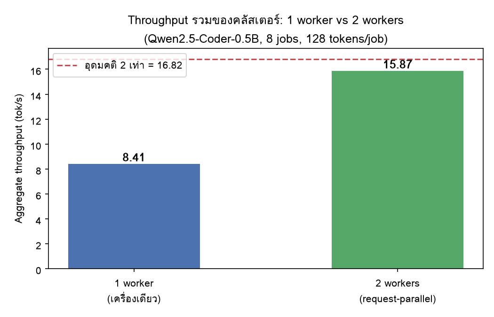
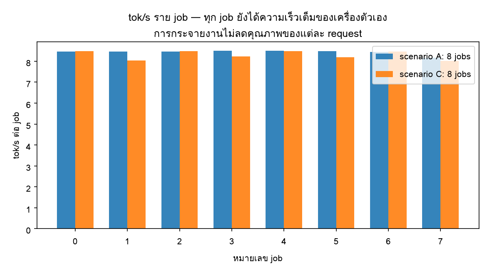
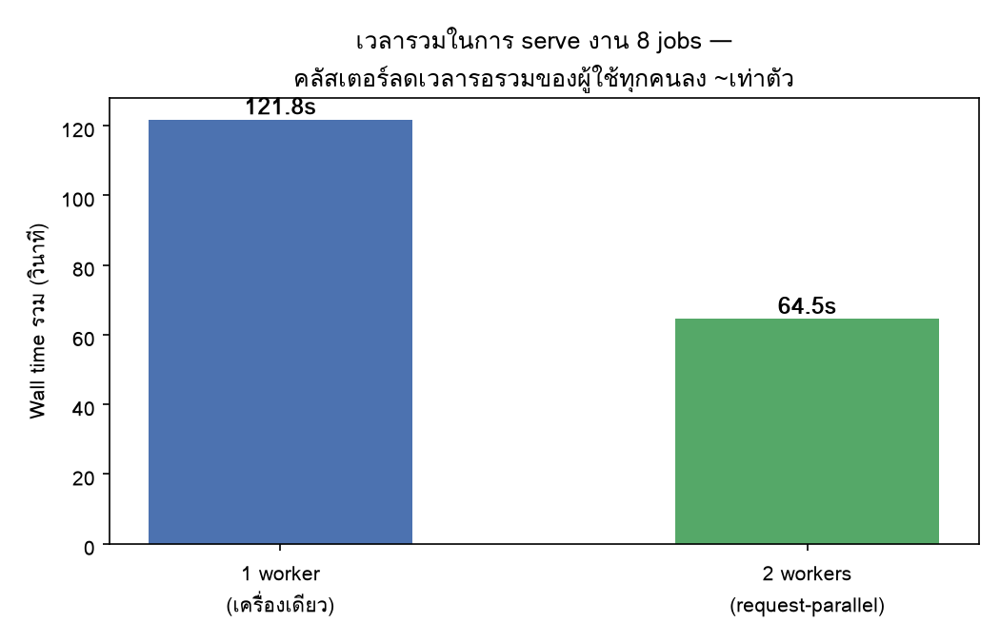

# 🍓 PiCluster — Raspberry Pi คลัสเตอร์ 2 ตัว สำหรับให้บริการ Local LLM

โปรเจควิชาระบบปฏิบัติการ (Operating Systems): สร้างคลัสเตอร์ Raspberry Pi 2 ตัว
พร้อมระบบกระจายงานแบบ **master–worker ที่เขียนเองทั้งหมด** (Python, ไม่ใช้ framework)
แล้วใช้ **local LLM (llama.cpp)** เป็น workload จริง เพื่อวัดด้วยตัวเลขว่า
คลัสเตอร์ช่วยอะไรได้และไม่ได้อย่างไร

## 📊 ผลไฮไลต์

| สถานการณ์ | Wall time (8 jobs) | Aggregate throughput |
|---|---|---|
| A — เครื่องเดียว (1 worker) | 121.76 s | 8.41 tok/s |
| C — คลัสเตอร์ 2 เครื่อง (request-parallel) | **64.51 s** | **15.87 tok/s** |



- **Scaling efficiency 94%** (15.87 / 16.82 อุดมคติ) — ใส่เครื่องเพิ่ม 1 ตัว
  ผ่าน request พร้อมกันได้เกือบ 2 เท่าจริง ๆ
- ความเร็วต่อ request ไม่ลดลงเลย (~8.3 tok/s ทุก job) — คลัสเตอร์ช่วย
  **throughput ไม่ใช่ latency**
- เครือข่ายสายตรง: **943 Mbit/s** (iperf3), RTT **0.24 ms**

## 🏗️ สถาปัตยกรรม

```
client ──SUBMIT──▶ master ──JOB──▶ worker A ──▶ llama-server (loopback ของ Pi A)
client ◀─RESULT─── master ◀─JOB_RESULT─ worker A
client ◀──DONE──── master ◀─JOB_RESULT─ worker B ──▶ llama-server (loopback ของ Pi B)
                        ▲
                        └──HEARTBEAT ทุก 2 วิ (พอร์ต 5556)
```

- **Protocol**: 4-byte length prefix + JSON ผ่าน TCP (`common.py`)
- **Fault tolerance**: ไม่ได้รับ heartbeat เกิน 8 วิ → ถือว่า worker ตาย,
  job ที่ค้าง**หรือ job ที่รายงาน error** ถูกส่งใหม่ให้ worker อื่นอัตโนมัติ
  (สูงสุด 3 ครั้ง = at-least-once); worker ที่หลุดจะกลับมา register ใหม่เอง
- **เครือข่าย**: Pis ต่อสาย LAN ตรงถึงกัน (subnet 10.0.0.0/24, static IP) —
  traffic ของคลัสเตอร์วิ่งสายจุดต่อจุด, ใช้ WiFi สำหรับ SSH/ควบคุมงาน

## 🖥️ ฮาร์ดแวร์และซอฟต์แวร์

| องค์ประกอบ | รายละเอียด |
|---|---|
| Node | Raspberry Pi 4 Model B 2 × (RAM 2GB) |
| OS | Raspberry Pi OS Lite 64-bit (Debian-based) |
| Inference | llama.cpp (สร้างจากซอร์ส, `-j2`), llama-server ต่อ node |
| โมเดล | Qwen2.5-Coder-0.5B-Instruct, Q4_K_M (491 MB) |
| เครือข่าย | Gigabit Ethernet ต่อตรง, iperf3 วัด 943 Mbit/s |

## 🚀 การใช้งาน

### ติดตั้งบนแต่ละ Pi

```bash
# 1) swap 2GB กัน build OOM บนเครื่อง RAM 2GB
sudo sed -i 's/^CONF_SWAPSIZE=.*/CONF_SWAPSIZE=2048/' /etc/dphys-swapfile
sudo systemctl restart dphys-swapfile

# 2) build llama.cpp
sudo apt install -y git cmake build-essential
git clone --depth 1 https://github.com/ggml-org/llama.cpp ~/llama.cpp
cmake -S ~/llama.cpp -B ~/llama.cpp/build && cmake --build ~/llama.cpp/build --config Release -j2

# 3) โมเดล (~491 MB)
mkdir -p ~/models && cd ~/models
wget https://huggingface.co/Qwen/Qwen2.5-Coder-0.5B-Instruct-GGUF/resolve/main/qwen2.5-coder-0.5b-instruct-q4_k_m.gguf
```

### รันคลัสเตอร์

```bash
# บน rpi4b-1 (master + worker 1)
~/llama.cpp/build/bin/llama-server -m ~/models/qwen2.5-coder-0.5b-instruct-q4_k_m.gguf \
    --host 127.0.0.1 --port 8080 -c 512 -t 4
cd ~/pi-cluster && python3 master.py
python3 worker.py --master 10.0.0.1 --name rpi4b-1 --port 8080

# บน rpi4b-2 (worker 2)
~/llama.cpp/build/bin/llama-server -m ~/models/qwen2.5-coder-0.5b-instruct-q4_k_m.gguf \
    --host 127.0.0.1 --port 8080 -c 512 -t 4
cd ~/pi-cluster && python3 worker.py --master 10.0.0.1 --name rpi4b-2 --port 8080

# ยิงงาน (จากเครื่องไหนก็ได้ที่เข้าถึง master)
python3 client.py --master 10.0.0.1 --requests 8 --max-tokens 128
```

ทดสอบ pipeline โดยไม่ต้องมี llama.cpp: `python3 worker.py --master <ip> --name w1 --mock`

### Web Console (แชท + สถานะ + สลับโมเดล บน rpi4b-1)

```bash
# บน rpi4b-1 — worker ต้องเป็นโหมด managed (worker spawn llama-server เอง)
python3 worker.py --master 10.0.0.1 --name rpi4b-1 --model <ชื่อไฟล์.gguf>
python3 webui.py        # เปิดเบราว์เซอร์: http://192.168.1.223:8000
```

- **แชทผ่านคลัสเตอร์**: ทุกข้อความถูกส่งเข้า master แล้วกระจายให้ worker —
  bubble คำตอบบอกเสมอว่า **Pi ตัวไหนประมวลผล, กี่ tok/s, กี่วินาที**
- **สถานะโหนด**: อุณหภูมิ / RAM ว่าง / uptime / สุขภาพ llama-server /
  โมเดลปัจจุบัน ของทั้งสองเครื่อง — มาจาก heartbeat ของ worker เอง
  (โปรโตคอลเดียวกัน ไม่ใช้ SSH)
- **สลับโมเดล**: เลือก .gguf ที่มีอยู่ใน `~/models` ของ *ทั้งสองเครื่อง*
  แล้วกดสลับ — master สั่งผ่าน control channel, worker restart
  llama-server ของตัวเองแล้วรายงานผลกลับเข้า activity feed
- master เปิด read-only status API ที่พอร์ต 5557 (`GET /api/cluster`,
  `POST /api/model`)

### Telegram bot (แจ้งสถานะ Pi)

```bash
export TG_BOT_TOKEN=<token จาก BotFather>
python3 tgbot.py   # แล้วทัก /start ที่บอท — จะแจ้ง 🟢 online / 🔴 offline ทันที
```

## 🧪 การทดลอง

| เซ็ตอัป | วิธี | ข้อสรุปที่ต้องการพิสูจน์ |
|---|---|---|
| A | ลงทะเบียน worker เดียว, ยิง 8 jobs | baseline ต่อเครื่อง |
| B | แบ่งโมเดลข้ามเครื่องด้วย llama.cpp RPC | การ split ไม่ช่วยความเร็วราย request |
| C | worker สองตัว + ยิง 8 requests พร้อมกัน | คลัสเตอร์ช่วย throughput |




## 🎓 แนวคิด OS ที่ครอบคลุม

- **Process & IPC**: job dispatch ผ่าน TCP socket, JSON framing เอง
- **Concurrency**: threading บน master (dispatcher, heartbeat monitor,
  connection handlers) พร้อม lock/condition
- **Fault tolerance**: heartbeat + timeout + job requeue (ลอง Ctrl-C worker
  กลางงานดู — job ไม่หาย)
- **Scheduling**: first-free-worker dispatch, load balancing
- **Memory hierarchy**: ทำไม token generation ผูกกับ RAM bandwidth
  และ network จึงเป็น bottleneck ของการ split โมเดล
- **Page cache**: รอบวัดแรกช้ากว่ารอบถัดไป — จึงต้อง warm-up ก่อนวัด

## 🧯 ปัญหาที่พบจริงระหว่างทำ (บทเรียนสำคัญ)

1. **build llama.cpp ตายกลางทางบน RAM 2GB** → เพิ่ม swap 2GB + build ด้วย `-j2`
2. **WiFi หลุดเป็นระยะ** → ย้าย traffic ของคลัสเตอร์ลงสาย LAN ทั้งหมด
3. **PSU เสีย (undervoltage)** → `vcgencmd get_throttled` จับได้; เปลี่ยน PSU
   5.1V/3A แล้วค่ากลับเป็น 0x0
4. **สาย LAN ขาดคู่สาย** → link ได้แค่ 100M (gigabit ต้องใช้ครบ 4 คู่);
   เปลี่ยนสายแล้วได้ 943 Mbit/s
5. **`wget -c -O` resume ไม่ทำงาน** → ใช้คลัสเตอร์คัดลอกไฟล์จาก node ที่มี
   ไฟล์สมบูรณ์แล้วผ่านสายตรงแทน (491 MB ใน ~16 วิ)
6. **worker ตายเป๊ะทุก 5 วินาที** → socket จาก `create_connection(timeout=5)`
   ไม่ได้เคลียร์ timeout ก่อนเข้าลูปรับ job — ต้อง `settimeout(None)`

## 📁 โครงสร้าง

```
pi-cluster/
├── common.py        # JSON framing ผ่าน TCP
├── master.py        # scheduler: dispatch, heartbeat, requeue
├── worker.py        # agent: รับ job → เรียก llama-server → ส่งผล
├── client.py        # ยิงงาน + สรุปผล
├── tgbot.py         # Telegram bot แจ้งสถานะ Pi
├── plot_results.py  # สร้างกราฟจาก results/
├── results/         # ข้อมูลการทดลอง + กราฟ
└── report/          # รายงาน PDF
```
